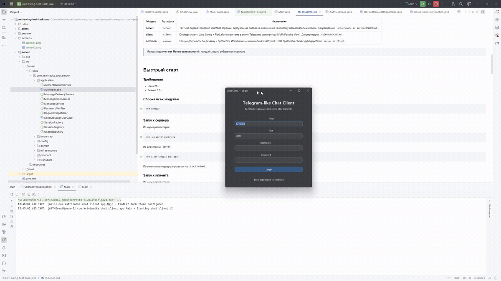
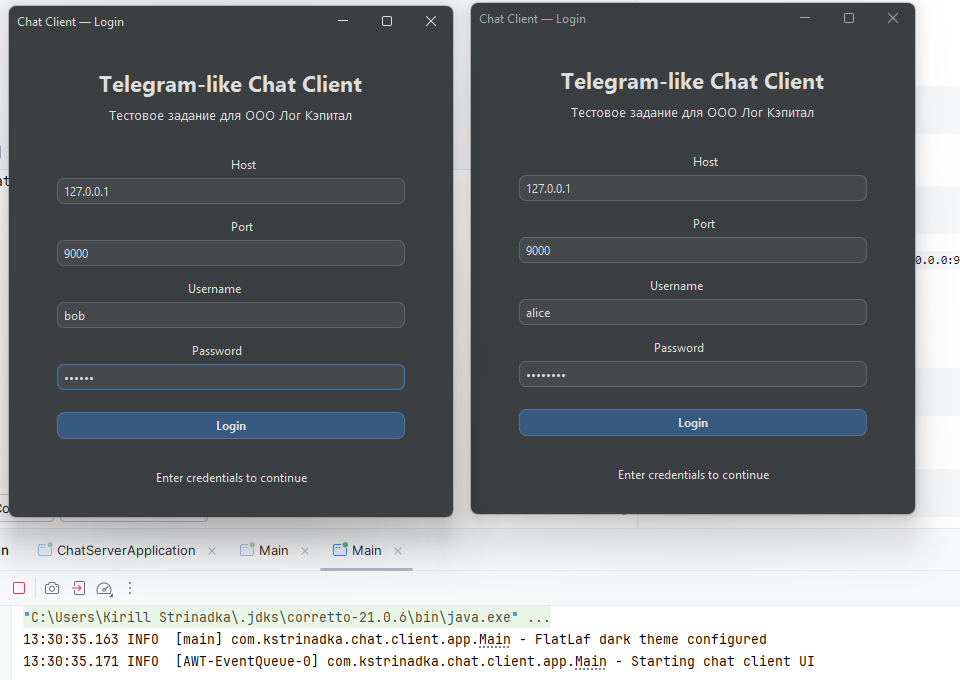
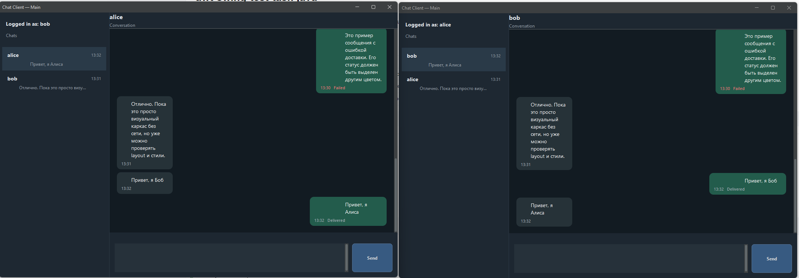

# awt-swing-test-task-java

## Как это выглядит

Ниже показан пример использования приложения: два одновременно запущенных экземпляра клиента, вход пользователей и обмен сообщениями в реальном времени.

**Демо (анимация работы приложения)**



**Окно логина (`screen1`)**



**Окно чата (`screen2`)**



Многомодульный Maven-проект с **TCP-чатом** на Java 21.  
Проект состоит из TCP-сервера чата и desktop-клиента на Swing, которые обмениваются данными по протоколу **JSON Lines** (один JSON-объект в строке, разделитель `\n`).

## Модули

| Модуль | Артефакт | Назначение |
|--------|----------|------------|
| **server** | `server` | TCP чат-сервер: протокол JSON по строкам, виртуальные потоки на соединение, in-memory пользователи и сессии. Документация: `server/doc/` и `server/README.md`. |
| **client** | `client` | Desktop-клиент: Java Swing + FlatLaf (темная тема в стиле Telegram), архитектура MVP (Passive View). Документация: `client/README.md`. |
| **common** | `common` | Общие документы по дизайну и протоколу. Исходники — минимальная заглушка; DTO протокола сейчас дублируются в `server` и `client`. |

> Между модулями **нет Maven-зависимостей**: каждый модуль собирается отдельно.

---

## Быстрый старт

### Требования

- Java 21+
- Maven 3.8+

### Сборка всех модулей

```bash
mvn compile
```

### Запуск сервера

Из корня репозитория:

```bash
mvn -pl server exec:java
```

Из директории `server`:

```bash
mvn clean compile exec:java
```

По умолчанию сервер запускается на `0.0.0.0:9000`.

### Запуск клиента

Из корня репозитория:

```bash
mvn -pl client exec:java
```

Из директории `client`:

```bash
mvn clean compile exec:java
```

После запуска откроется окно логина. Подключайтесь к `localhost:9000` и используйте одного из тестовых пользователей (см. раздел [Протокол и тестовые пользователи](#протокол-и-тестовые-пользователи)).

### Запуск всех тестов

```bash
mvn test -pl server,client
```

---

## Границы MVP

### Сервер

- Аутентификация по логину/паролю (`AUTH`)
- Отправка текстовых сообщений от одного пользователя другому (`SEND`)
- Push-доставка входящих сообщений адресату (`INCOMING`)
- Ping / keep-alive (`PING`)
- Базовая валидация протокола (обязательные поля, порядок запросов)
- In-memory хранение пользователей и сессий

### Клиент

- Окно логина с TCP `AUTH` к серверу
- Основное окно чата: список диалогов + область сообщений + поле ввода (темная тема в стиле Telegram)
- Отправка и получение текстовых сообщений
- Локальное хранение диалогов в памяти клиента (без серверной истории)

### Что намеренно не реализовано (в обоих модулях)

- Нет постоянной истории сообщений (после рестарта процесса данные теряются)
- Нет групповых чатов (только 1:1)
- Нет статусов присутствия и "печатает..."
- Нет вложений, редактирования и удаления сообщений
- Нет TLS/SSL (чистый TCP)
- Нет read receipts

---

## Архитектура

### Сервер — слоистая архитектура (без Spring)

```
bootstrap  →  transport  →  protocol  →  application  →  domain
                    ↑                         ↑
               infrastructure  ←─────────────┘
```

| Слой | Ключевые классы | Ответственность |
|------|------------------|-----------------|
| **bootstrap** | `ChatServerApplication`, `ApplicationAssembler` | Точка входа, ручная сборка зависимостей |
| **transport** | `ChatServer`, `SocketClientConnection`, `ConnectionContext` | TCP accept-loop, виртуальный поток на соединение, чтение/запись строк |
| **protocol** | `ClientRequest`, `ServerResponse`, `ProtocolMessageCodec` | JSON ↔ DTO, типы протокола, контракты валидации |
| **application** | `AuthUseCase`, `SendMessageUseCase`, `RequestDispatcher` | Use-cases и порты (`SessionRegistry`, `UserRepository`, сервисы) |
| **domain** | `ClientSession`, `ChatMessage`, `AuthResult`, `DeliveryResult` | Доменные сущности и результаты |
| **infrastructure** | `JacksonProtocolMessageCodec`, `InMemorySessionRegistry`, `Sha256PasswordVerifier`, ... | Реализации портов, codec, in-memory хранилища |

**Конкурентность:** каждое TCP-соединение обрабатывается отдельным **виртуальным потоком** (`Executors.newVirtualThreadPerTaskExecutor()`). Параллельные записи в один сокет сериализуются через `writeLock`.

### Клиент — Passive View + Presenter

| Слой | Ключевые классы | Ответственность |
|------|------------------|-----------------|
| **app** | `Main`, `ClientSession`, `ConnectionState` | Запуск приложения, настройка FlatLaf, сессионное состояние |
| **ui** | `LoginFrame`, `MainFrame`, `MessageBubblePanel` | Swing-окна и панели; реализуют `*View`, без сетевой логики |
| **presentation** | `LoginPresenter`, `ChatPresenter` | Состояние и orchestration, подготовка view-model (`MessageVm`, `ConversationListItemVm`) |
| **domain** | `Conversation`, `ConversationStore`, `Message` | Локальные модели клиента |
| **protocol** | `AuthRequest`, `SendRequest`, `JacksonProtocolCodec` | DTO и Jackson codec |
| **net** | `TcpChatClient`, `TcpChatClientListener` | TCP reader thread, корреляция request/response через `requestId` |

**Потоки:** обновления Swing UI выполняются только на **EDT** через `SwingUtilities.invokeLater(...)`, сетевые операции идут в фоновых потоках (`TcpChatClient`, executor в `LoginPresenter`).

---

## Протокол и тестовые пользователи

Транспортный протокол: **line-delimited JSON поверх TCP** (UTF-8, один JSON на строку, разделитель `\n`).

**Параметры сервера по умолчанию:**

| Параметр | Значение |
|----------|----------|
| Host | `0.0.0.0` |
| Port | `9000` |
| Socket read timeout | 60 000 ms |
| Max raw line length | 65 536 bytes |

**Встроенные тестовые пользователи:**

| Username | Password |
|----------|----------|
| `alice`  | `password` |
| `bob`    | `password` |

**Сводка типов сообщений:**

| Направление | Type | Описание |
|-------------|------|----------|
| Client → Server | `AUTH` | Аутентификация по `username` / `password` |
| Client → Server | `SEND` | Отправка текста получателю `to` |
| Client → Server | `PING` | Keep-alive, ответ не обязателен |
| Server → Client | `AUTH_OK` | Успешная аутентификация |
| Server → Client | `AUTH_ERROR` | Ошибка аутентификации |
| Server → Client | `ACK` | Подтверждение доставки |
| Server → Client | `INCOMING` | Push: входящее сообщение для пользователя |
| Server → Client | `ERROR` | Протокольная или delivery-ошибка |

Полная спецификация протокола: [`server/doc/server-api.md`](server/doc/server-api.md)  
(зеркало: [`common/docs/server-api.md`](common/docs/server-api.md))

---

## Тесты

### Тесты сервера

| Тест-класс | Что покрывает |
|------------|---------------|
| `ChatServerSmokeTest` | Запуск/останов сервера и базовый request-response цикл |
| `JacksonProtocolMessageCodecTest` | Сериализация/десериализация протокольных DTO |
| `DefaultProtocolValidatorTest` | Валидация входящих запросов и генерация `ErrorResponse` |

```bash
mvn -pl server test
```

### Тесты клиента

| Тест-класс | Что покрывает |
|------------|---------------|
| `MainSmokeTest` | Smoke-тест запуска приложения |
| `TcpChatClientCorrelationTest` | Корреляция `requestId` и соответствия request/response |
| `ChatPresenterTest` | Поведение презентера: переходы состояния, обновления view-model |
| `JacksonProtocolCodecTest` | Клиентский protocol codec |

```bash
mvn -pl client test
```

---

## Технологический стек

| Область | Технология |
|---------|------------|
| Язык / Платформа | Java 21 |
| Сборка | Maven (multi-module) |
| Сеть | `ServerSocket` / `Socket` (JDK), virtual threads |
| Сериализация | Jackson (`jackson-databind`, `jackson-datatype-jsr310`) |
| UI | Java Swing + [FlatLaf](https://www.formdev.com/flatlaf/) (dark theme) |
| Логирование | SLF4J / Logback |
| Тестирование | JUnit 5, AssertJ, Mockito |

---

## Структура проекта

```
awt-swing-test-task-java/
├── pom.xml                        # Родительский POM (Java 21, UTF-8)
├── server/
│   ├── README.md                  # Документация модуля server
│   ├── pom.xml
│   ├── doc/
│   │   ├── README.md              # Индекс документации и порядок чтения
│   │   ├── project-overview.md    # Обзор всего multi-module проекта
│   │   ├── server-api.md          # Спецификация протокола (основная)
│   │   ├── server-architecture.md # Слои и роли классов
│   │   ├── request-flow.md        # Жизненный цикл запросов и заметки по потокам
│   │   └── server-module-tree.md  # Дерево файлов модуля server
│   └── src/
│       ├── main/java/com/kstrinadka/chat/server/
│       │   ├── bootstrap/         # Точка входа, composition root
│       │   ├── transport/         # TCP сервер, соединения, outbound channel
│       │   ├── application/       # Use-cases и порты
│       │   ├── domain/            # Доменные сущности и результаты
│       │   ├── protocol/          # DTO запросов/ответов, codec, validator
│       │   └── infrastructure/    # Реализации портов, in-memory хранилища
│       └── test/...
├── client/
│   ├── README.md                  # Документация модуля client
│   ├── pom.xml
│   └── src/
│       ├── main/java/com/kstrinadka/chat/client/
│       │   ├── app/               # Запуск, main, состояние сессии
│       │   ├── ui/                # Swing окна и панели
│       │   ├── presentation/      # Presenters и View interfaces
│       │   ├── domain/            # Локальные модели диалогов
│       │   ├── protocol/          # Клиентские DTO и Jackson codec
│       │   └── net/               # TcpChatClient (reader thread, correlation)
│       └── test/...
└── common/
    ├── pom.xml
    ├── docs/
    │   ├── server-api.md          # Спека протокола (копия server/doc/server-api.md)
    │   ├── design-doc.md          # Исходные design-заметки и решения
    │   └── coding-plan.md         # Пошаговый план реализации
    └── src/main/java/com/kstrinadka/
        └── Main.java              # Заглушка
```

---

## Дополнительные материалы

| Документ | Что содержит |
|----------|--------------|
| [`server/README.md`](server/README.md) | Обзор server-модуля, архитектура, жизненный цикл, ограничения |
| [`client/README.md`](client/README.md) | Обзор client-модуля, Passive View, threading model, UI решения |
| [`server/doc/server-api.md`](server/doc/server-api.md) | Полная спецификация протокола: поля JSON, коды ошибок, примеры |
| [`server/doc/server-architecture.md`](server/doc/server-architecture.md) | Детальная разбивка по слоям и ответственности классов |
| [`server/doc/request-flow.md`](server/doc/request-flow.md) | Сценарии AUTH / SEND и заметки по конкурентности |
| [`common/docs/design-doc.md`](common/docs/design-doc.md) | Исходные архитектурные решения и trade-offs |
